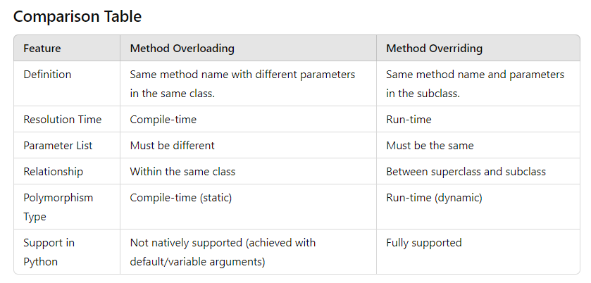

Method Overloading
Definition: Method overloading allows a class to have more than one method with the same name, as long as their parameter lists are different (either in the number of parameters or types of parameters). It is a feature found in some languages like Java, but it is not natively supported in Python.

Method Overriding
Definition: Method overriding occurs when a subclass provides a specific implementation for a method that is already defined in its superclass. The method in the subclass should have the same name, return type, and parameter list as the method in the superclass.

